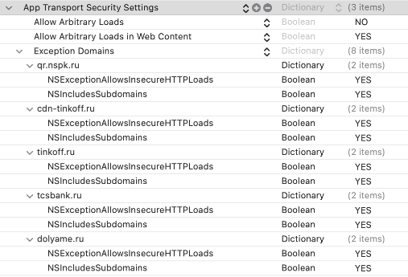

# Долями iOS SDK, руководство по интеграции

## До интеграции SDK

Перед тем как интегрировать Долями SDK, вам необходимо предоставить вашему персональному менеджеру из команды Долями SDK следующие данные:

Данные|Формат|Зачем используются
---|---|---
Название магазина|Название магазина, предпочтительно чтобы вмещалось в одну строку|В нашем интерфейсе мы показываем название магазина для того чтобы пользователь знал в каком магазине он покупает
Иконка магазина|JPG/PNG, без альфа-канала или прозрачных частей, квадратный, разрешение мин. 160x160 макс. 480x480, без контента по углам, так как в дизайне углы иконки будут обрезаться до состояния круга.|Иконка магазина будет отображаться в интерфейсах SDK для того, чтобы пользователь видел в каком магазине приобретает товар

## Установка SDK

[Инструкция по установке в Installation.md](./docs/Installation.md)

## Подготовительные работы на вашем бэкенде

Для работы с SDK от вашего бэкенда требуется ТОЛЬКО:
- поддержка [вебхука Долями](https://dolyame.ru/develop/help/webhooks/)
- умение вызывать [Commit, Cancel, Info и Refund](https://dolyame.ru/develop/help/api/) для работы с заказом

URL на который будет приходить вебхук вы можете передать вашему контакту Долями или указать в `notificationUrl`.

Для работы с SDK Долями вашему бэкенду НЕ нужно вызывать `Create`!

## Алгоритмика использования SDK

Минимальная версия iOS 12.0, bitcode выключен.

Для интеграции SDK нужно:
- встроить настройки `NSAppTransportSecurity` в `Info.plist`
- встроить в свой интерфейс кнопку **Оплатить Долями**, класс `DolyamePaymentButton`.
- создать объект координатора SDK, класс `DolyamePaymentCoordinator`
- подписаться на результат работы координатора, проперти, `DolyamePaymentCoordinator.onFinish`.
- вызвать `start` на `DolyamePaymentCoordinator`

<p style="page-break-after: always;">&nbsp;</p>

# Секция 0: `NSAppTransportSecurity` в `Info.plist`

Нужно добавить `qr.nspk.ru`, `cdn-tinkoff.ru`, `tinkoff.ru`, `tcsbank.ru` и `dolyame.ru` в App Transport Security - Excluded Domains. Для каждого из них нужно сделать `AllowsInsecureHTTPLoads = YES` и, обязательно, `NSIncludesSubdomains = YES`. Также необходимо указать свойство `AllowsArbitraryLoadsInWebContent = YES`.

<details>
    <summary>Вот так будет выглядеть секция Info для таргета вашего приложения</summary>



</details>
<details>
    <summary>Пример raw Info.plist с нужными значениями</summary>

```text.xml.plist
<key>NSAppTransportSecurity</key>
<dict>
    <key>NSAllowsArbitraryLoads</key>
    <false/>
    <key>NSAllowsArbitraryLoadsInWebContent</key>
    <true/>
    <key>NSExceptionDomains</key>
    <dict>
        <key>qr.nspk.ru</key>
        <dict>
            <key>NSExceptionAllowsInsecureHTTPLoads</key>
            <true/>
            <key>NSIncludesSubdomains</key>
            <true/>
        </dict>
        <key>cdn-tinkoff.ru</key>
        <dict>
            <key>NSExceptionAllowsInsecureHTTPLoads</key>
            <true/>
            <key>NSIncludesSubdomains</key>
            <true/>
        </dict>
        <key>tinkoff.ru</key>
        <dict>
            <key>NSExceptionAllowsInsecureHTTPLoads</key>
            <true/>
            <key>NSIncludesSubdomains</key>
            <true/>
        </dict>
        <key>tcsbank.ru</key>
        <dict>
            <key>NSExceptionAllowsInsecureHTTPLoads</key>
            <true/>
            <key>NSIncludesSubdomains</key>
            <true/>
        </dict>
        <key>dolyame.ru</key>
        <dict>
            <key>NSExceptionAllowsInsecureHTTPLoads</key>
            <true/>
            <key>NSIncludesSubdomains</key>
            <true/>
        </dict>
    </dict>
</dict>
```
</details>

# Секция 1: Кнопка "Оплатить Долями"

## Класс `DolyamePaymentButton`
Этот класс является саб-классом UIView и функционирует как обычная `UIView` сверстанная на AutoLayout. По дизайну, на данный момент, это широкая кнопка с текстом "Оплатить Долями" в одну строку, который помещается только в полную ширину экрана, в недалеком будущем подразумевается создание альтернативной, узкой версии которую можно будет посместить на половину ширины экрана.

Кнопка "Оплатить Долями" из коробки имеет характерный дизайн продукта Долями и не требует никакой конфигурации.

Не ставье `NSLayoutConstaint` на высоту кнопки Долями. Доверьтесь той высоте, которую кнопка хочет сама по себе.

При нажатии на кнопку будет вызван event handler `onButtonPressed`, который приложение интегратор выставляет на инстансе кнопки через проперти `DolyamePaymentButton.onButtonPressed`.
```swift
public class DolyamePaymentButton: UIView {
    public var onButtonPressed: (() -> Void)?
}
```

Этот хэндлер будет вызываться при каждом нажатии на кнопку и в результате работы этого хэндлера, вы должны сами перейти к следующему шагу работы с Долями SDK.

<p style="page-break-after: always;">&nbsp;</p>

# Секция 2: Сборка конфигурации Долями

Объект конфигурации собирается после нажатия юзером на кнопку "Оплатить Долями". Он собирается для того, чтобы позже быть переданным в координатор в следующей секции.

## `DolyamePaymentConfiguration`, корневой объект

Название|Тип|Описание
---|---|---
partner|`DolyamePaymentConfiguration.Partner`|Объект, описывающий данные о партнере, который интегрировал оплату Долями
order|`DolyamePaymentConfiguration.Order`|Объект, описывающий характеристики заказа, содержимое ниже
customerInfo|`DolyamePaymentConfiguration.CustomerInfo`|Объект, описывающий известные данные о покупателе, содержимое ниже
enableCallKitUsage|`Bool`|Разрешено ли использовать API CallKit, по-умолчанию `true`, описание ниже

<p style="page-break-after: always;">&nbsp;</p>

## `DolyamePaymentConfiguration.Partner`

Название|Тип|Описание
---|---|---
id|`String`|Уникальный идентификатор партнера, который будет выдан вам для интеграции. Если не выдали, свяжитесь с персональным менеджером Долями.
notificationUrl|`String`|Адрес, на который мы будем отправлять вебхук подтверждения результата оплаты. Если вы захотите зафиксировать боевой адрес на нашем бэке, чтобы не отправлять его здесь, обратитесь к персональному менеджеру Долями.
demoFlow|`Bool`|Понадобится при разработке. Этот флаг указывает, что данный запуск SDK должен быть через demoFlow. Подробности ниже, в секции "Тестирование интеграции".
showErrorScreenDebugInformation|`Bool`|Понадобится при разработке. Этот флаг включает визуальное отображение кодов ошибок на экранах ошибок. Рекомендуем включить на время разработки и тестирования.

<p style="page-break-after: always;">&nbsp;</p>

## `DolyamePaymentConfiguration.Order`

Название|Тип|Описание
---|---|---
id|`String`|Уникальный идентификатор заказа. Должен быть уникальным при каждом создании объекта конфигурации. В случае, если юзер попадает в флоу Долями для конкретного заказа во второй раз, нужно предоставить новый уникальный идентификатор.
amount|`Decimal`|Сумма для оплаты через сервис Долями. <br />Должно соблюдаться условие `amount + prepaidAmount == items.map { i in i.quantity * i.price }.reduce(0, +)`
prepaidAmount|`Decimal`|Сумма аванса, внесенного клиентом через другие способы оплаты. Например, оплата бонусами или подарочным сертификатом. <br />Должно соблюдаться условие `amount + prepaidAmount == items.map { i in i.quantity * i.price }.reduce(0, +)`
items|`[DolyamePaymentConfiguration.Order.Item]`|Массив с позициями в заказе
mcc|`Int`|MCC код с которым нужно совершить платеж. Указывайте значение 5311.

<p style="page-break-after: always;">&nbsp;</p>

## `DolyamePaymentConfiguration.Order.Item`
Название|Тип|Описание
---|---|---
name|`String`|Наименование товара
quantity|`Int`|Количество позиций данного наименования
price|`Decimal`|Цена одной позиции
sku|`String?`|SKU товара (уникальный идентификатор для каждого товара/артикул/первичный ключ). **Убедительная просьба** для товаров присылать SKU, т.к. из-за "кривых" названий (пробелы, пентаграммы и символы) могут возникнуть проблемы при возвратах клиентов.

<p style="page-break-after: always;">&nbsp;</p>

## `DolyamePaymentConfiguration.CustomerInfo`
Название|Тип|Описание
---|---|---
id|`String`|Уникальный идентификатор пользователя. При изменении учетной записи, мы ожидаем что будет приходить новый идентификатор, в том числе, если юзер был или стал не залогинен
firstName|`String?`|Имя покупателя. Обязательно передайте, если оно известно. Это необходимо для заполнения анкеты покупателя
lastName|`String?`|Фамилия покупателя. Обязательно передайте, если известна. Это необходимо для заполнения анкеты покупателя 
middleName|`String?`|Отчество покупателя. Обязательно передайте, если известно. Это необходимо для заполнения анкеты покупателя
phone|`String?`|Телефон клиента в формате +7. Если известен, **обязательно-обязательно** передайте. Пожалуйста! Это помогает нам в прохождении авторизации. Пример: `+79130010101`
birthday|`String?`|Дата рождения клиента в формате 28.05.1991. Обязательно передайте, если известна. Это необходимо для заполнения анкеты покупателя
email|`String?`|Email клиента. Обязательно передайте, если известен. Это необходимо для заполнения анкеты покупателя

<p style="page-break-after: always;">&nbsp;</p>

## Флаг `enableCallKitUsage`

Начиная с 2022 года, в App Store для страны Китай нельзя использовать API CallKit. При этом, символы и модуль могут быть упомянуты, однако на стороне кода должна быть бизнес-логика которая определяет что приложение запущено в Китае и отключает использование этих API. При этом на этапе ревью придет reject, и Apple запросит подтверждение, что действительно в приложении есть такая бизнес-логика. Нужно указать, что "да" и затем ревью будет пройдено.

Мы используем функцонал CallKit и предоставляем способ его выключить. Но вместо того, чтобы самим брать ответственность за определение региона и принятие решения, мы оставляем это право вам. Из того, что мы видели в интернете, достаточно проверки региона текущей локали, однако вы можете использовать другие методы.

Если ваше приложение не выклыдывается в китайский стор или вы никогда не сталкивались с такой проблемой App Review, то рекомендуем никогда не отключать это поведение. Именно поэтому этот флаг по-умолчанию `true`.

<p style="page-break-after: always;">&nbsp;</p>

## Важные аспекты работы с объектом конфигурации

Идентификатор заказа `Order.id` должен быть уникальный при каждом запуске SDK. Если пользователь:
- попал во флоу Долями SDK чтобы оплатить заказ
- не оплатил заказ
- вернулся в ваше приложение
- захотел опять попасть во флоу Долями SDK
То:
- обязательно `Order.id` должен отличаться от того, с каким юзер уже заходил в Долями SDK.

При запуске флоу в SDK сохраняется полученный `CustomerInfo.id`. При последующих запусках SDK происходит
проверка `CustomerInfo.Id`:
- если был получен идентичный id, то авторизация в SDK сохраняется
- если был получен id, отличный от сохранённого при предыдущем запуске, то пользователь будет
разлогинен и должен будет заново пройти процесс авторизации

<p style="page-break-after: always;">&nbsp;</p>

# Секция 3: Запуск координатора флоу Долями

Имея собранный объект конфигурации, мы имеем все что нужно для того чтобы отправить пользователя во флоу Долями.

## Класс `DolyamePaymentCoordinator`

Этот класс является точкой входа и выхода для всего флоу.

### Параметры в конструкторе
Для того чтобы начать работу, необходимо создать координатор. Ниже представлен перечень параметров.

Название|Тип|Описание
---|---|---
configuration|`DolyamePaymentConfiguration`|Объект конфигурации, подробности в Секция 2
modalHostViewController|`UIViewController`|Вьюконтроллер, который уже находится на экране для того чтобы мы модально презентовали поверх него свой контент.

Вам необходимо хранить этот интанс координатора после создания. Если вы отпустите инстанс координатора, это нарушит работоспособность SDK.  
Также, мы не храним сильную ссылку на `UIViewController`, который вы нам передаете, во избежание retain-цикла.

<p style="page-break-after: always;">&nbsp;</p>

### Подписка на результат работы координатора

В конце своей работы, координатор уведомит вас о том, что он закончил работать.  Здесь, координатор уберет все экраны которые сам создавал для того, чтобы вернуть приложение в то состояние, в котором вы передали его SDK.

Публичный интерфейс конца работы флоу SDK выглядит следующим образом:

```swift
public enum DolyamePaymentCoordinatorResult {
    case success
    case failure
    case pending
    case dismissed
}

public class DolyamePaymentCoordinator {
    public var onFinish: ((DolyamePaymentCoordinatorResult) -> Void)?
}
```

Вам необходимо выставить `DolyamePaymentCoordinator.onFinish`. Внутри него вам **обязательно** нужно удалить координатор оттуда, куда вы его записывали.

Вот что обозначают значения этого результата:
Значение|Значение
---|---
`success`|Пользователь прошел флоу и успешно совершил платеж
`pending`|Пользователь прошел флоу и совершил платеж, но мы еще не получили подтверждение от эквайринга
`failure`|Пользователь наткнулся на ошибку, отказ скоринга, проблемы с авторизацией или интернетом
`dismissed`|Пользователь добровольно вышел из SDK, смахнул экраны или нажал на кнопку Закрыть

### Запуск координатора

Сейчас, когда координатор сконфигурирован, его можно запустить. Запуск приведет к показу экранов и запуску логики SDK.

Запуск производится посредством вызова метода `DolyamePaymentCoordinator.start`.
```swift
public class DolyamePaymentCoordinator {
    public func start()
}
```

<p style="page-break-after: always;">&nbsp;</p>

# Тестирование интеграции

## Демо-заявка

Для того чтобы не тестировать на проде, SDK предлагает возможность проверки интеграции через демо заявку.

Отличия демо-заявки от нормального флоу:
- перед запуском основного флоу вам будет показан экран, на котором вы можете выбрать результат, чем флоу кончится
- не будет производиться работа с эквайрингом. При этом, подтверждение платежа будет приходить аналогично настоящему.

Есть пять вариантов окончания флоу: 
1. Отказ скоринга
1. Успешная оплата 1го платежа
1. Неуспешная оплата 1го платежа
1. Результат оплаты неизвестен, но в итоге оплата пройдет успешно
1. Результат оплаты неизвестен и в итоге неуспешная оплата

Шаги для запуска демо-заявки:
- в конфигурации `Partner` нужно указать `notificationUrl`, чтобы он указывал на ваше тестовое окружение. Если вы не укажете здесь `notificationUrl`, то вы не получите подтверждения платежа, даже если при интеграции вы давали дефолтный URL. Так как он не тестовый, а боевой.
- передайте в `demoFlow` значение `true`

<p style="page-break-after: always;">&nbsp;</p>

## Неожиданные события

В процессе работы SDK Долями могут возникнуть непредвиденные ситуации. С точки зрения UX, мы берем на себя реагирование на них и правильный вывод пользователя из флоу SDK обратно в приложение партнера. Однако, для целей проверки интеграции, во время тестирования подключенного SDK, вам стоит подписаться на эти события, чтобы быть в курсе, если вы сделали что-то неправильно.

Хэндлер события вызыватся в результате работы с сервером, и не сразу. Когда вы только откроете SDK, хэндлер не будет вызван и вам нужно пойти дальше по флоу, чтобы проверить появление (или отсутствие) какого-то события. Хэндлер события может быть вызван на любой `DispatchQueue`, но это не страшно потому что вы не должны проводить никакие манипуляции с интерфейсом. Не забудьте про `weak self`.

Подписаться на события можно через `DolyamePaymentCoordinator.onUnexpectedEvent`:

```swift
public enum DolyameUnexpectedEvent {
    case lessThanRuble
    case haveSumDifference
    case haveItemsDifference
    case wrongPersonData
    case noPartnerForClient
}

public class DolyamePaymentCoordinator {
    public var onUnexpectedEvent: ((DolyameUnexpectedEvent) -> Void)?
}
```

Далее представлена таблица неожиданных событий.

<p style="page-break-after: always;">&nbsp;</p>

Неожиданное событие|Что значит?|Что делать?
---|---|---
`lessThanRuble`|Сумма заказа была меньше 1 рубля|Посмотреть, какие значения заказа были отправлены в конфигурацию SDK. Сумма в `item`'ов должна быть больше 1 рубля. `amount` тоже должен быть больше 1 рубля.
`haveSumDifference`|Сумма позиций в заказе не совпадает с общей суммой заказа. Данные заказа, которые вы предоставялете в конфигруации SDK должны удовлетворять уравнению `amount + prepaidAmount == items.map { i in i.quantity * i.price }.reduce(0, +)`.|Проверьте заказ, отправленный в SDK на сооветствие этому уравнению. Если с вашей стороны математика сходится, то пожалуйста, обратитесь с этим инцидентом к вашему персональному менеджеру в Долями.
`haveItemsDifference`|Позиции заказа отличаются от ранее полученных|Этот кейс никогда не должен приходить, потому что при каждом открытии SDK мы создаем новый заказ, не связанный с предыдущими. Если вы получили это событие, сообщите об этом менеджеру по интеграции Долями.
`wrongPersonData`|Переданные данные отличаются от хранимых|Этот кейс также не должен никогда случаться, но на случай если случится, сообщите об этом вашему персональному менеджеру по интеграции Долями.
`noPartnerForClient`|Ошибка доступа к SDK|Обратитесь к вашему персональному менеджеру по интеграции Долями.

<p style="page-break-after: always;">&nbsp;</p>